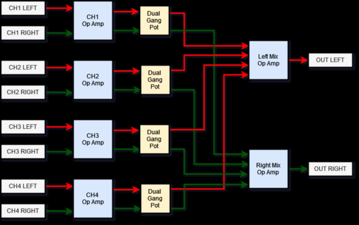

# Tiny 4 Channel Powered Stereo Mixer

A Tiny form-factor 4-channel Stereo Mixer for use with TV/PC/Turntable/Amplifer

## Requirements

1. 4 stereo inputs
2. 1 stereo output
3. Inputs will all use stereo RCA/Phono connectors
4. volume controls for each of the 4 input channels
5. volume controls should be mounted in the front of the case
6. External power input shall be 9V DC
7. Internal power supply shall be +/-9V DC
8. Input signals shall be buffered
9. Volume controls for each channel shall  be independant and not subtract gain from the other channels.
  
## Top level Design

