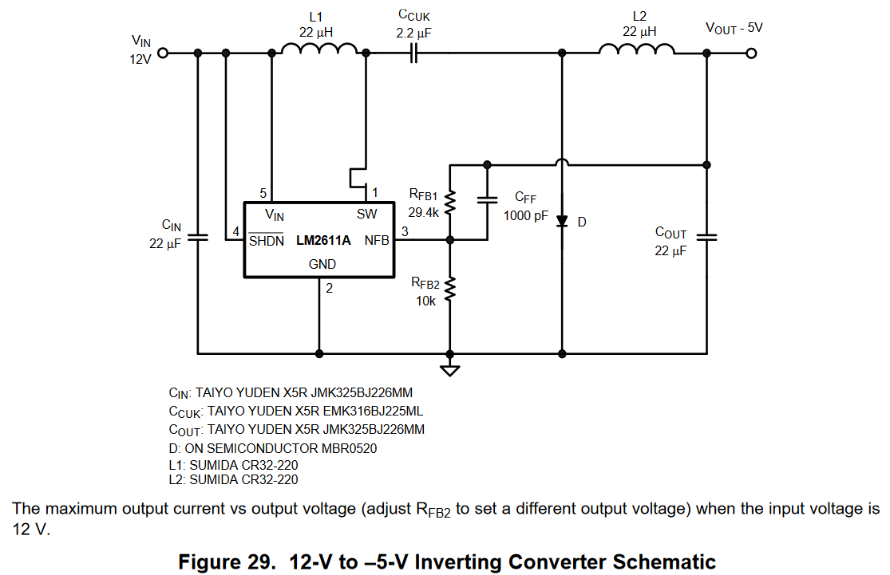

HTML version of this page can be found [here](https://cracked-machine.github.io/Tiny4xPoweredStereoMixer/)

# Tiny 4 Channel Powered Stereo Mixer

A Tiny form-factor 4-channel stereo mixer for use with TV/PC/Turntable/Amplifer

## Requirements

1. 4 stereo inputs
2. 1 stereo output
3. Inputs will all use stereo RCA/Phono connectors
4. volume controls for each of the 4 input channels
5. volume controls should be mounted in the front of the case
6. External power input shall be 9V DC
7. Internal power supply shall be +/-9V DC
8. Input signals shall be buffered
9. Volume controls for each channel shall  be independant and not subtract gain from the other channels.
10. Cross-talk between channels should be minimised.
  
## Top level Design

The opamps shall use [TL072](https://www.ti.com/lit/gpn/TL072H)

Using opamps to buffer the input signals and mix the channels together will ensure that the volume of each channel can be mixed independently from the others.

The design will implement an inverting opamp "virtual  ground" topology. The virtual ground refers to the inputs of the mixing opamp: the non-inverting input will be referenced to ground, which means the voltage at both opamp inputs will be referenced to ground because the potential _difference between inputs_ will always try to be zero. The absence of voltage at these inputs will prevent cross-talk between the channels. There is a far superior explanation of this concept at [sound-au.com](https://sound-au.com/articles/audio-mixing.htm#s3)

## Power Stage Design

To power the buffer and mixer opamps, the design will need a power stage that supports 

1. Bi-polar or symmetric voltage rails that will allow "rail-to-rail" positive and negative headroom for the +/- audio signal.
2. Enough current for 5 (4 input + 1 mix) dual channel opamps. 

The simplest method for creating a negative voltage rail is....tonot create a negative voltage rail! In other words: use a voltage divider to create DC bias mid-point at the positive voltage rail. This has the effect of level-shifting the operating point of the opamp so that the ground reference is halfway between 0 volts and the positive rail. This requires only passive components - which is cheap - but also complicates the opamp design and can create issues with the opamp behaviour itself. You also have to be careful to filter out the DC from the input and output to prevent "pops" and damage to other devices such as speakers. I'm not a fan for these reasons. 

A better way is to actually create a new negative voltage rail from the existing positive rail. 

You can do this easily with a charge pump voltage regulator. This is an inductorless topology - already a benefit - but has very limited current capabilities - usually only 10-40mA - and is unregulated. This means the generated negative voltage is easily pulled down by the load if it consists of more than a couple of opamps. In practical terms, you could require a charge pump circuit for each opamp channel. Its also recommended to put a passive low pass filter on each charge pump output to prevent ripple. Each charge pump circuit requires roughly 6 components. In total that could be lot of components when you multiply that per opamp, per channel.

In the end I settled on the Cuk regulator topology using the [LM2611](https://www.ti.com/lit/ds/symlink/lm2611.pdf) converter IC. This is a buck-boost type regulator with an inverted output rail. And it comes in a tiny SOT-23 footprint!

Here is the reference design from the datasheet. 

The output voltage can be adjusted using the negative feedback resistors RFB1 and RFB2:

|VREF|RFB1|RFB2|VOUT|
|-|-|-|-|
|-1.23v|10K|88.7k|VREF * (1 + (RFB2/RFB1)  = -12.14v|

The application curve from the datasheet shows that with -12V output, the max current it could provide would be 400mA.

Bearing in mind the quiescent voltage of each TL072 opamp is only 1.2mA, this is overkill. However, during active use, the current will certainly be higher. Additionally, I'm always sceptical about the claims of load regulation on these regulator IC's. So this is an experiment as much as anything else.  I will be testing the power supply stage with a variable load to see how close this spec is to real world current draw. 

Final note on the Cuk topology: There don't appear to be many IC's out there that support this type of regulator. Either it's overlooked or it has some major drawback that I'm missing here.

**TODO: ADD LOAD RESULTS HERE**

## Schematics

<object data="doc/design/Tiny4xPoweredStereoMixer.pdf" type="application/pdf" width="100%" height="1000px">
    <embed src="doc/design/Tiny4xPoweredStereoMixer.pdf">
        
This browser does not support PDFs. Please download the PDF to view it: <a href="doc/design/Tiny4xPoweredStereoMixer.pdf">Download PDF</a>.

    </embed>
</object>

## Layout

I used a 4 layer board so I could have a layer per voltage rail. This makes routing the traces significantly easier. I kept the board dimensions below 10cm to minimize manufacture costs. 

[ibom](https://cracked-machine.github.io/Tiny4xPoweredStereoMixer/doc/design/ibom.html)

## Enclosure

I plan to 3D print the enclosure. Designs will follow...

**TODO: ADD DESIGNS HERE**
