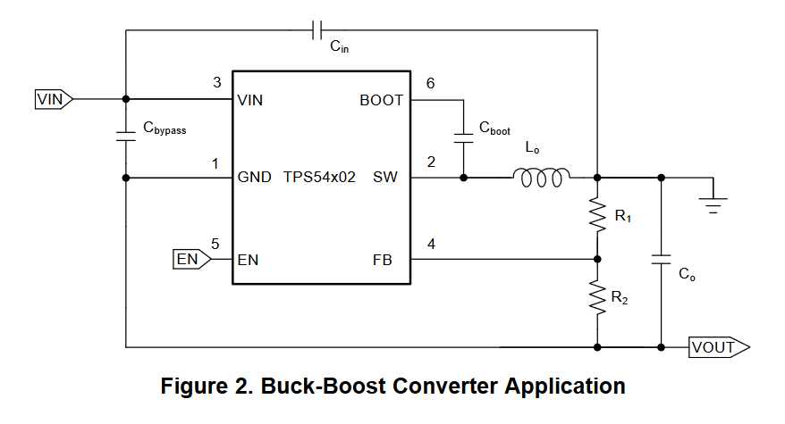

HTML version of this page can be found [here](https://cracked-machine.github.io/Tiny4xPoweredStereoMixer/)

# Tiny 4 Channel Powered Stereo Mixer

A Tiny form-factor 4-channel stereo mixer for use with TV/PC/Turntable/Amplifer

## Requirements

1. 4 stereo inputs
2. 1 stereo output
3. Inputs will all use stereo RCA/Phono connectors
4. volume controls for each of the 4 input channels
5. volume controls should be mounted in the front of the case
6. External power input shall be 9V DC
7. Internal power supply shall be +/-9V DC
8. Input signals shall be buffered
9. Volume controls for each channel shall  be independant and not subtract gain from the other channels.
10. Cross-talk between channels should be minimised.
  
## Top level Design

The opamps shall use [TL072](https://www.ti.com/lit/gpn/TL072H)

Using opamps to buffer the input signals and mix the channels together will ensure that the volume of each channel can be mixed independently from the others.

The design will implement an inverting opamp "virtual  ground" topology. The virtual ground refers to the inputs of the mixing opamp: the non-inverting input will be referenced to ground, which means the voltage at both opamp inputs will be referenced to ground because the potential _difference between inputs_ will always try to be zero. The absence of voltage at these inputs will prevent cross-talk between the channels. There is a far superior explanation of this concept at [sound-au.com](https://sound-au.com/articles/audio-mixing.htm#s3)

## Power Stage Design

The old PSU design for Rev A/B can be found in [OLDPSU.md](OLDPSU.md).

The negative voltage rail is generated from the positive rail using a [TPS54202](https://www.ti.com/lit/ds/symlink/tps54202.pdf) SMPS IC. This is normally a buck regulator. However, it can be configured to generate a negative voltage when pin 2 is clamped to ground, forcing pin 1 to a negative voltage.

Further details can be found in the [SLVA933](https://www.ti.com/lit/an/slva933/slva933.pdf) app note

### Soft Start

Unlike the LM2611, the TPS54202 has an internal soft start circuit. This can be seen in the Function Block Diagram of the [TPS54202](https://www.ti.com/lit/ds/symlink/tps54202.pdf) datasheet.

### Output Voltage 

Output voltage is selected using the voltage divider between pins 2 and 1, creating feedback into pin 4. This is very similar to the normal operation of this IC.

### Current Draw and Load Regulation

Output ripple is shown in the [SLVA933](https://www.ti.com/lit/an/slva933/slva933.pdf) app note as 5mV at no load and 20mV at 0.8A (see pages 21-22).

For my own test I [created a small board](https://github.com/cracked-machine/tps54202_inverting_breakout).
The original layout example with the new configuration violated the layout guiidelines from the [TPS54202](https://www.ti.com/lit/ds/symlink/tps54202.pdf) datasheet and proved to be noisy (240mV @ 0.6A). A second revision was made with a better layout that observed the guideline and was a significant improvement (80mv @ 0.6A).

Load regulation was around 5%, dropping from 12V to 11.4V @ 0.6A.

These results were acceptable so this PSU design was used.

## Schematics

<object data="doc/design/Tiny4xPoweredStereoMixer.pdf" type="application/pdf" width="100%" height="1000px">
    <embed src="doc/design/Tiny4xPoweredStereoMixer.pdf">
        
This browser does not support PDFs. Please download the PDF to view it: <a href="doc/design/Tiny4xPoweredStereoMixer.pdf">Download PDF</a>.

    </embed>
</object>

## Layout

I used a 4 layer board so I could have a layer per voltage rail. This makes routing the traces significantly easier. I kept the board dimensions below 10cm to minimize manufacture costs. 

[Interactive BOM](https://cracked-machine.github.io/Tiny4xPoweredStereoMixer/doc/design/ibom.html)

## Enclosure

I abandoned the 3D printed enclosure idea and made the PCB to fit this [Hammond RM2005MTBK](https://www.hammfg.com/part/RM2005MTBK) clam shell enclosure.

